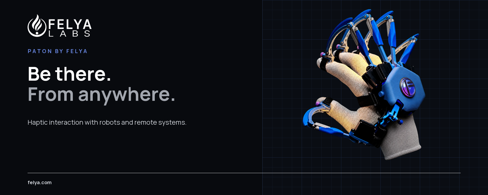

FELYA develops PATON, a haptic interface for interaction with robots and remote systems.

PATON connects an operator's hand movements with remote machines and returns haptic feedback.

## Explore FELYA

| Destination | Purpose |
|---|---|
| [**felya.com**](https://felya.com) | Discover FELYA, PATON and our approach to haptic interaction |
| [**FELYA Brand Guide**](https://brand.felya.com) | Explore our visual system, design tokens and brand assets |

## Published on GitHub

- [`felya-website-public`](https://github.com/felya-labs/felya-website-public) — production snapshot of the FELYA website
- [`felya-brand-guide-public`](https://github.com/felya-labs/felya-brand-guide-public) — published snapshot of the canonical Brand Guide

> [!NOTE]
> Core product development takes place in private repositories. Public deployment repositories are generated snapshots and are not edited directly.

## Work with us

Interested in haptics, robotics, embodied interfaces or the future of remote physical work? Explore [felya.com](https://felya.com) or contact [info@felya.com](mailto:info@felya.com).
