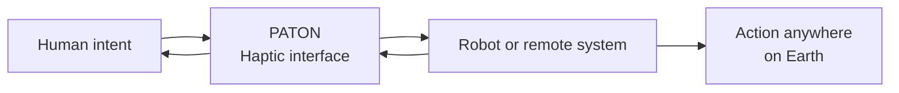

# FELYA

> **Your hands. Anywhere on Earth.**

FELYA develops PATON, a haptic interface for intuitive interaction with robots and remote systems.

## Human intent, connected to the physical world

PATON connects human dexterity with machines across distance. The interface is designed to make robotic interaction direct, embodied and useful in the real world.

## Published spaces

| Explore | What you will find |
|---|---|
| [**felya.com**](https://felya.com) | FELYA, PATON and the systems we are building |
| [**FELYA Brand Guide**](https://brand.felya.com) | Brand principles, visual language, design tokens and assets |
| [**Production website repository**](https://github.com/felya-labs/felya-website-public) | Published static snapshot of the FELYA website |
| [**Published Brand Guide repository**](https://github.com/felya-labs/felya-brand-guide-public) | Published static snapshot of the canonical Brand Guide |

> [!NOTE]
> Core product development currently takes place in private repositories. Public deployment repositories are generated snapshots and are not edited directly.

## Work with FELYA

Interested in haptics, robotics, embodied interfaces or remote physical work? Start with [felya.com](https://felya.com) or contact [info@felya.com](mailto:info@felya.com).
